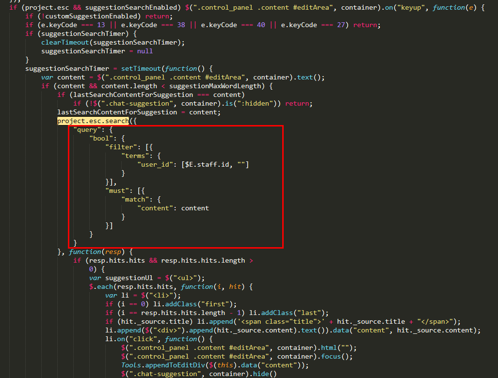

# 后续维护须知

1. elasticsearch的索引chat 需要手动建，具体创建操作如下：（后续如果升级这块应该不需要动）
    - `put http://192.168.1.63:9200/chat`
    - body: `{"settings":{"index":{"number_of_replicas":"1","number_of_shards":"5"}},"mappings":{"1":{"properties":{"content":{"type":"text","analyzer":"ik_max_word"},"title":{"type":"text","analyzer":"ik_max_word"},"user_id":{"type":"text","fields":{"keyword":{"type":"keyword","ignore_above":256}},"fielddata":true}}}}}`

2. `/usr/local/tomcat/webapps/ngs/js/plugins/chat.min.js`文件中需要修改如下内容
    - 找到`project.esc.search`处
    
    - 将图中红框部分替换成`{"query":{"bool":{"must":[{"match":{"content":content}}],"should":[{"script":{"script":{"source":"doc['user_id'].values.length==0","lang":"painless"}}},{"term":{"user_id":$E.staff.id}}],"minimum_should_match":1}}}`

